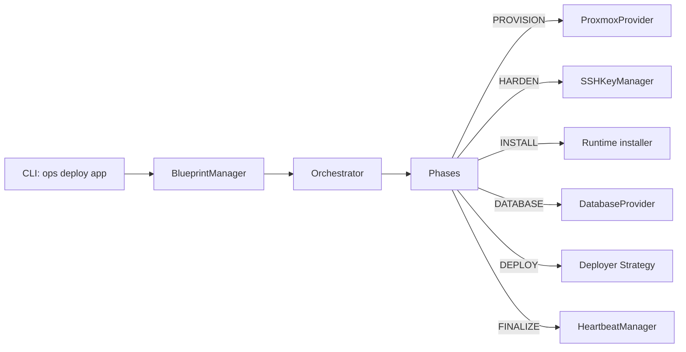

# Architecture

Ops is organized into clear architectural layers, each with a single responsibility.

## High-Level Flow



## Layer Breakdown

### 1. Models (`ops.models`)

Pydantic v2 schemas that enforce strict validation at every API boundary.

| Model | Purpose |
|---|---|
| `OpsConfig` | User config (`~/.ops/config.yaml`) |
| `AppBlueprint` | Application blueprint with container, network, deployment, secrets, templates |
| `DeploymentState` | Persistent phase-tracked state per application |
| `ProxmoxHostConfig` | Proxmox connection parameters |
| `SubnetConfig` | Network subnet, gateway, bridge, DNS |
| `ClusterNode` | Auto-discovered cluster node registry entry |

### 2. Core (`ops.core`)

| Component | Responsibility |
|---|---|
| `Orchestrator` | Phase dispatch engine (`deploy`, `teardown`, `restart`, `sync`, `get_logs`) |
| `ConfigManager` | Load/save encrypted YAML config, master key in OS keyring |
| `StateManager` | Load/save encrypted JSON deployment state per app |
| `BlueprintManager` | Resolve built-in + user blueprints, validate schema version |
| `AuditLogger` | Append-only structured log at `~/.ops/audit.log` |
| `HeartbeatManager` | HTTP health checks and manifest generation |

### 3. Providers (`ops.providers`)

| Provider | External System |
|---|---|
| `ProxmoxProvider` | Proxmox VE REST API via `proxmoxer` |
| `DatabaseProvider` | PostgreSQL provisioning (databases, users, grants) |
| `InfisicalProvider` | Infisical secrets manager integration (optional) |
| `MicroVMProvider` | SSH-based QEMU microVM lifecycle on Proxmox node |

### 4. Deployers (`ops.deployers`)

Strategy pattern: each deployer handles a single deployment type.

| Deployer | Type | Description |
|---|---|---|
| `DockerDeployer` | `docker` | Runs `docker compose up` inside LXC |
| `NativeDeployer` | `native` | Generates systemd service + env file |
| `MicroVMDeployer` | `firecracker` (backend=`pve-microvm`) | Manages QEMU microVM via `qm` |
| `NestedFirecrackerDeployer` | `firecracker` (backend=`lxc`) | Runs Firecracker binary inside LXC with `/dev/kvm` passthrough |
| `WasmDeployer` | `wasm` | Executes `.wasm` artifact via `wasmtime` |

### 5. Utilities (`ops.utils`)

| Utility | Purpose |
|---|---|
| `SecretManager` | Fernet encryption for secrets at rest |
| `SSHKeyManager` | Ed25519 key generation, deployment, rotation |
| `TemplateEngine` | Sandboxed Jinja2 rendering |
| `IPAllocator` | IP address allocation from CIDR subnet |
| `safe_shell` | Shell command quoting via `shlex.quote` |

### 6. CLI (`ops.cli`)

Single-file Typer application dispatching to core components.

| Command | Action |
|---|---|
| `deploy` | Full phased deployment |
| `teardown` | Stop, backup, destroy |
| `status` | Show deployment phase + health |
| `logs` | Tail or follow logs |
| `start` / `stop` / `restart` | Lifecycle control |
| `sync` | Re-render templates and restart |
| `exec` | Run arbitrary commands in container |
| `onboard` | Add Proxmox host to config |
| `blueprint-list` / `blueprint-init` | Blueprint management |
| `cluster-join` / `cluster-leave` / `cluster-status` | Cluster operations |

## Deployment Phase Lifecycle

```
PREFLIGHT     → Validate blueprint, discover resources
  PROVISION   → Create LXC or microVM
    HARDEN    → SSH keys, sshd hardening
      INSTALL → Docker, runtimes
        DATABASE → Create DB/user
          DEPLOY → Push templates, start workload
            FINALIZE → Health check, heartbeat manifest
```

Each phase is idempotent. If a phase is already complete, it is skipped on re-run.
